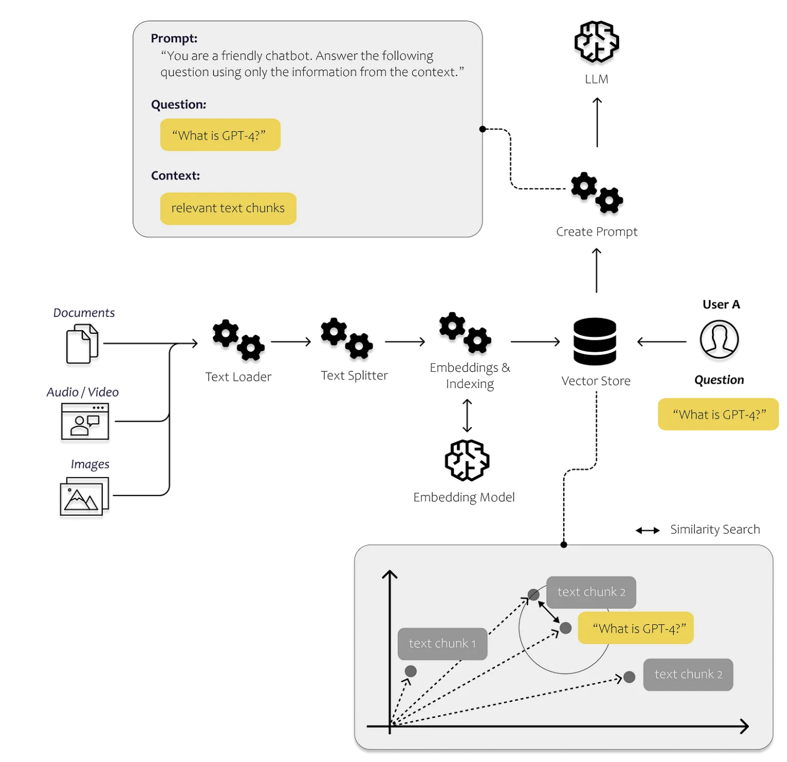
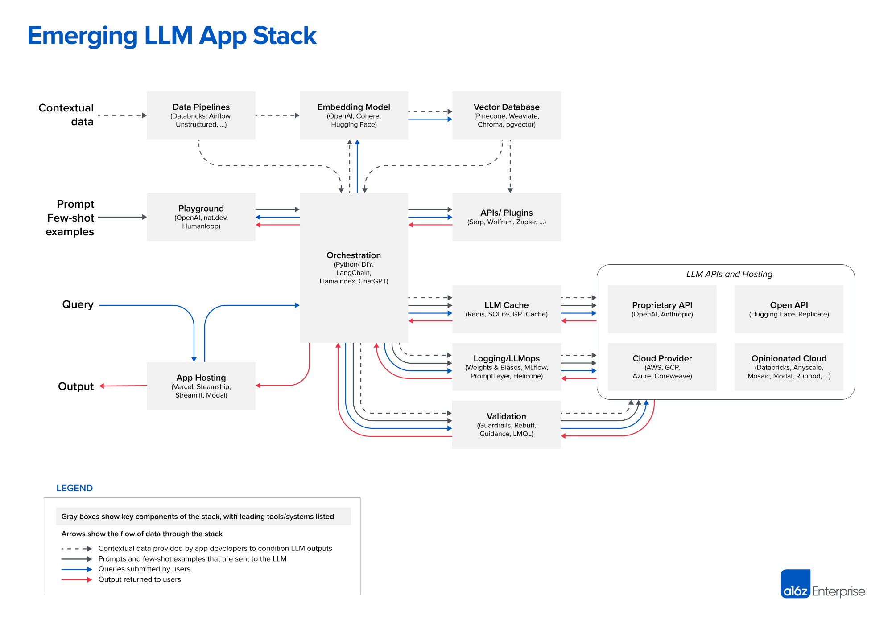

# 基于大语言模型的项目研发指南

    中文  |  <a href="README-EN.md">English</a> 

本项目旨在为希望做大模型应用开发的和在学习基于大模型做应用开发的同学提供上手指南, 帮助理解大模型在大模型应用中承担的角色, 同时也是自己在大模型应用开发过程中的学习记录和学习材料内容的整理

## LLM APP 处理流程概览

图片来源: [towardsdatascience.com](https://towardsdatascience.com/all-you-need-to-know-to-build-your-first-llm-app-eb982c78ffac)  : Build your own chatbot with context injectionr

图片来源: [a16z.com](https://a16z.com/2023/06/20/emerging-architectures-for-llm-applications/)  : Emerging LLM App Stack